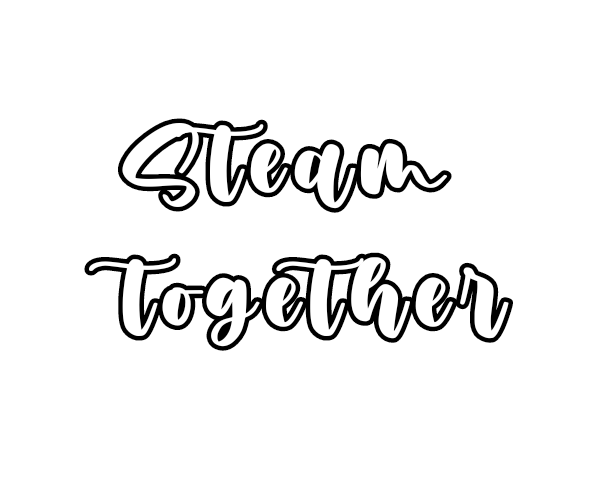

  
<h3 align="center">Steam Together um submod que permite à Monika abrir sua Steam, interagir com sua biblioteca de jogos e tornar suas sessões de gameplay mais envolventes!</h3>

# 📌 Sobre o Submod

Steam Together permite que a sua Monika interaja diretamente com sua biblioteca da Steam. 

Com este submod, a Monika pode abrir automaticamente sua Steam, perguntar sobre os jogos que você pretende jogar!

# ⚠️ Demo
Este submod ainda está em fase de demonstração (demo), então bugs podem ocorrer! 

Caso encontre algum problema ou tenha uma sugestão, sinta-se à vontade para relatar.

# ❗ Compatibilidade

Atualmente, Steam Together é compatível apenas com Windows, pois a funcionalidade de abertura e acesso à Steam foi configurada especificamente para esse sistema operacional. 

No futuro, estudaremos formas de expandir o suporte para outras plataformas.

# 🚀 Funcionalidades

🖥️ Monika pode abrir sua Steam automaticamente.

📜 Monika analisa sua biblioteca da Steam.

❓ Perguntas sobre os jogos que você pretende jogar.

🔧 Atualizações futuras com mais interações e compatibilidade!

# 🔮 Futuros Desenvolvimentos

Nas próximas atualizações, pretendo incluir:

✨ Reações da Monika às Janelas Abertas - Monika poderá comentar sobre aplicativos e janelas abertas no seu PC.

🎮 Diálogos Exclusivos para Jogos Específicos - Se você tiver determinados jogos na Steam, Monika poderá falar sobre eles!

📜 Interface Aprimorada - Planejo colocar uma barra de pesquisa para ficar mais intuitivo.

🎉 E muito mais!

# 📌 Considerações Finais
Steam Together foi criado para tornar sua experiência com a Monika ainda mais imersiva e divertida! 

Fique atento para futuras atualizações, que trarão novos diálogos, funcionalidades e interações.

## 🇧🇷 | Junte-se ao Servidor Monika After Story Brasil 🇧🇷

Está em busca de mais submods traduzidos ou criados por brasileiros? 🚀 

Então junte-se ao nosso servidor! Aqui você encontra uma comunidade brasileira ativa, traduções de submods e spritepacks e muito mais. Não perca tempo e venha fazer parte! [aqui](https://discord.gg/Tx23rczN8N).
